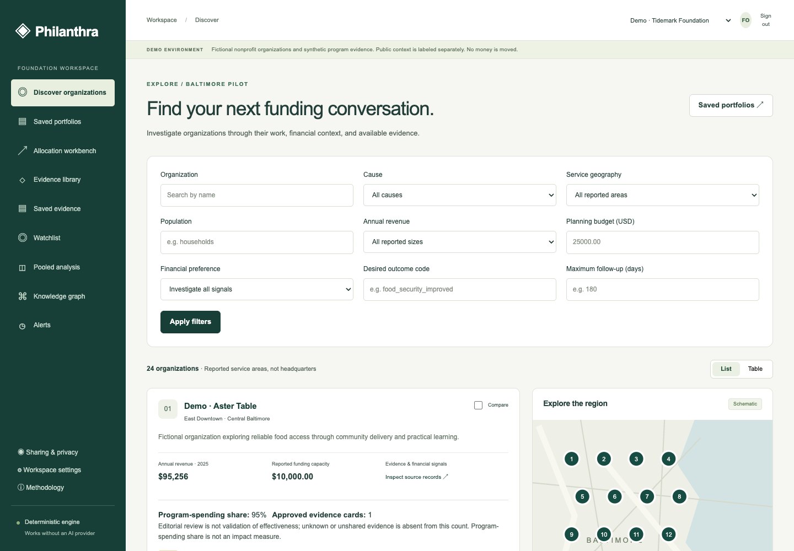
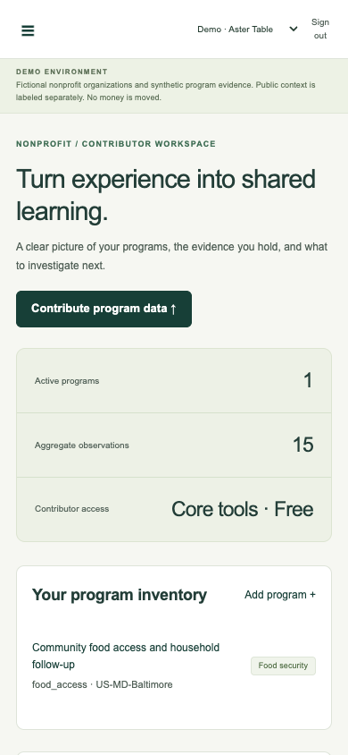

# Banyan

A runnable, permissioned pilot for donor investigation and NGO learning, starting with Baltimore-area food security. It connects public financial records, contributor aggregates, intervention knowledge, source provenance and human review. Allocation and knowledge calculations are deterministic; no paid AI service is required.

**Demo organizations, grants and studies are fictional.** The small Census city-context extract is separately labeled public data. Planning drafts are not completed grants, review by demo accounts is not expert validation, and this repository does not establish real-world effectiveness or global coverage.

## Launch

Prerequisites: Git, Python 3.12 or 3.13, Node 24, and either Docker with Compose or PostgreSQL 17 client/server tools. Initial dependency installation needs internet; the prepared demo and deterministic tests use no live external API. The observed development machine used macOS/Node 24.14.0/Python 3.12.4/PostgreSQL 17.11. Linux and macOS terminal paths are supported; Compose is prepared but was not run here because Docker was unavailable.

```sh
cd "/path/to/Philanthra"
make doctor
make setup
make demo
```

Open **http://127.0.0.1:8080/demo**. On macOS, double-click **Start Banyan Demo.command** after installing prerequisites. For the native macOS path, install PostgreSQL 17 with `brew install postgresql@17`; scripts discover its Homebrew path and keep the cluster inside `.runtime/pg`. No change to a global conda installation is needed. On Linux without Docker, install PostgreSQL 17 and set PG_BIN to its binary directory if not on PATH.

`make demo` chooses Compose when Docker is installed (its daemon must be running); otherwise it starts project-local PostgreSQL, migrates, idempotently seeds, starts API/web/worker and waits for readiness. Records persist across restarts. `make stop` stops tracked application processes without removing data. Native ports are 8080(web),8000(API),55432(database), all loopback; Compose exposes only the proxy port 8080. To apply local source changes to the built demo: `make stop`, `make build`, then `make demo`. Stop app services before `make dev` to switch to the development web server.

Demo-only accounts share password **`Demo-only-Banyan-2026!`**:

| Account | Workspace/role |
| --- | --- |
| foundation-admin / foundation-analyst / foundation-viewer | First foundation, appropriate write/read permissions |
| second-foundation | Isolated second foundation administrator |
| ngo-owner / ngo-editor / ngo-viewer | First NGO contributor roles |
| ngo2-owner / ngo3-owner / ngo4-owner | Separately permissioned pooled-evidence contributors |
| reviewer | Assigned independent demo reviewer |
| platform-admin | Platform operator; no automatic private NGO access |

Reserved credentials and role-entry buttons are for isolated demo use. Production refuses demo settings and seeded demo databases. Destructive demo reset is explicit: `make reset-demo CONFIRM=philanthra-demo`; it erases the known demo database and must not be used to preserve user-entered demonstration records.

## What works

- Donor discovery with real server filters, schematic map/list/table, organization history/source details, comparison, exact-cent constrained allocation drafts, review-bound reports and CSV.
- NGO profile/programs, aggregate CSV/XLSX mapping/preview/validation/commit, private text/PDF quarantine, sourced intervention cards, sharing, recommendations, alerts, bookmarks and withdrawals.
- Fixed cross-NGO binary analysis with compatibility/cohort checks, descriptive weighted/equal-organization summaries, heterogeneity and complementary-cell suppression.
- Session/CSRF authentication, invitations, multiple workspace memberships, reviewed identity claims, local password reset, reviewer separation, consent intersections and auditable use/deletion.
- Watchlists and queued revision monitoring; NGO reports/financial peer benchmarks; opportunity catalogue, stored onboarding/introduction requests, permissioned contacts and opt-in pilot metrics.
- Fixture-backed IRS 990/990-EZ/990-PF/990-N/status, ACS and IATI parsers, operator local catalogue import, generated authenticated OpenAPI/TypeScript contract, optional grounded explanation boundary.

Core routes: `/discover`, `/organizations/:id`, `/compare`, `/allocate`, `/portfolios`, `/dashboard`, `/programs`, `/uploads`, `/evidence`, `/analyses`, `/graph`, `/alerts`, `/saved`, `/watchlist`, `/impact-report`, `/sharing`, `/settings`, `/reviews`, `/sources`, `/methodology`, `/metrics`, `/jobs`, `/audit`. Authentication/role and source policy apply at the API; hiding navigation is not the permission mechanism.

The seeded backend has 20 local NGOs, four international examples, two foundations, 24 cards, 60 aggregate observations, eight schematic service areas, three portfolio drafts and at least six alerts. Seed data uses the same domain services, review and allocation logic as the app. See [the demo script](docs/DEMO_SCRIPT.md) for persisted donor and contributor journeys.

## Actual rendered interface

Screenshots below were captured from real-backend browser sessions, not mockups. More desktop/mobile review, analysis and portfolio captures are in docs/screenshots.





## Verification and operations

```sh
make check       # Ruff/format, domain/parser mypy, TypeScript, migrations and API drift
make test        # PostgreSQL backend tests with coverage + frontend component tests
make test-e2e    # isolated PostgreSQL/API/worker, desktop and mobile browser journeys
make build      # production Next build
make smoke      # separate migrated/seeded database and actual session/CSRF/API checks
make verify     # all deterministic gates above
make backup
make restore-test
make audit      # explicit network dependency audits; unavailable is not passed
```

Install the browser once with `bash scripts/pnpm exec playwright install chromium` (CI uses --with-deps). E2E creates a separately named test database and same-origin proxy8081; it does not overwrite the demo. Final observed results, actual coverage and verification limits are in [BUILD_STATUS](docs/BUILD_STATUS.md), [QA_REPORT](docs/QA_REPORT.md), [SECURITY_REVIEW](docs/SECURITY_REVIEW.md) and the [requirement matrix](docs/ACCEPTANCE_MATRIX.md). CI runs PostgreSQL-backed checks, drift detection, build/E2E, restore and separate network audits. An authored workflow is not a claim that remote CI has run successfully.

The architecture is Next.js/React/strict TypeScript plus Django 5.2/DRF/PostgreSQL, a leased worker and same-origin proxy. Dependency versions are in uv.lock/pnpm-lock.yaml. [.env.example](.env.example) documents configuration; processes read exported environment variables, not an implicit dotenv loader. Optional application AI requires PHILANTHRA_LLM_PROVIDER=openai, OPENAI_API_KEY and PHILANTHRA_LLM_MODEL plus source-specific external-processing grants. Default none remains fully functional; no live model request was used for verification.

Production prerequisites include TLS/reverse-proxy configuration, explicit hosts/origins/strong secrets, a clean dedicated database, encrypted disks/backups, defined retention and withdrawal replay on restore, configured email, operational monitoring/rate limiting, qualified human reviewers and measured pilot governance. No billing, donation transfer, automatic grant application, blanket worldwide coverage, licensed Candid access, causal impact estimate or validated distress probability is represented as complete.

See [architecture](docs/ARCHITECTURE.md), [data dictionary](docs/DATA_DICTIONARY.md), [API](docs/API.md), [methods](docs/METHODOLOGY.md), [privacy](docs/PRIVACY_AND_GOVERNANCE.md), [data sources](docs/DATA_SOURCES.md), [deployment](docs/DEPLOYMENT.md), [operations](docs/OPERATIONS.md) and [roadmap](docs/ROADMAP.md). The original Impact Commons proposal and original Git instructions are archived verbatim under [docs/source-materials](docs/source-materials/); Banyan is the product name.
