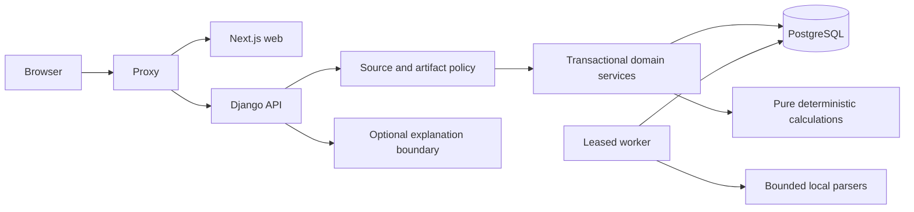

# Architecture

Philanthra is a permissioned, single-region pilot. Next.js App Router/React presents server-owned records through a same-origin Django REST API. PostgreSQL stores identities, memberships, aggregate observations, consent, revisions, review snapshots, jobs and audit events. Django sessions and CSRF protect browser actions. There is no frontend authentication database or browser token store.

Compose defines database, one-time init/migrate/seed, API, web, worker and proxy. Only loopback proxy port 8080 publishes a host port. The native developer path uses project-local PostgreSQL port 55432, API port 8000 and web port 8080; it is the observed alternative on a machine without Docker. This keeps PostgreSQL transaction behavior rather than substituting SQLite. See DEPLOYMENT.md for production separation.

The implementation consolidates normalized domain models into `philanthra/core` to keep one migration owner and avoid circular cross-app relations. `pilot` extends onboarding, identity review, contacts, watchlists and reports. `accounts`, `jobs`, `analytics`, `ingestion`, `catalog`, `demo` and `explanations` have explicit boundaries. Some endpoint orchestration remains in core/views; authorization and pure calculations are separate, and transactional services own snapshots/reviews/withdrawal. This is a modest layout deviation, not an additional service stack.

Public Organization identity is distinct from Workspace access authority. User memberships validate the active X-Workspace-ID; the browser cannot assign owners. Sources default private. A data-use grant is one complete tuple of purpose, recipient/audience, cause, geography, expiry and external-processing permission. Tuples cannot be assembled piecemeal. Derived artifacts retain every source revision and applicable grant revision; all must remain current. Owner permission to read a source is not permission to externally process it or publish pooled data.

Imports enqueue work inside transactions. Workers claim with SELECT FOR UPDATE SKIP LOCKED, lease tokens and expiry. Work is idempotent; completion rechecks current lease and authorization. Withdrawal and publication/finalization serialize on source locks. Raw uploads expire after 24hours and never become public file URLs. Large-file processing never runs in HTTP request handlers.

Financial calculations, constrained allocation, matching, pooling, peer comparison and evaluation are pure Python modules with versioned outputs. PostgreSQL full-text search uses permitted card IDs and public directory records. The graph exposes bounded one-hop source-backed relationships; normalized cost/outcome/funding foreign keys supplement explicit editorial edges. Planning funder edges explicitly denote proposals, not grants.

OpenAPI is generated from backend serializers and annotations; `packages/api-client/schema.d.ts` is generated by openapi-typescript. Run `make api-client` after contract changes and `make check` to detect drift. Dynamic analysis payloads have versioned methods and validated domain boundaries; they are not all expanded into fixed TypeScript interfaces.

No live data, licensed API, commercial AI service, email provider, vector database, graph database, map CDN or third-party analytics is required for the offline demo. Network source imports and live AI are explicit optional operations. Institutional plans change entitlements, never ranking or allocation weights.
